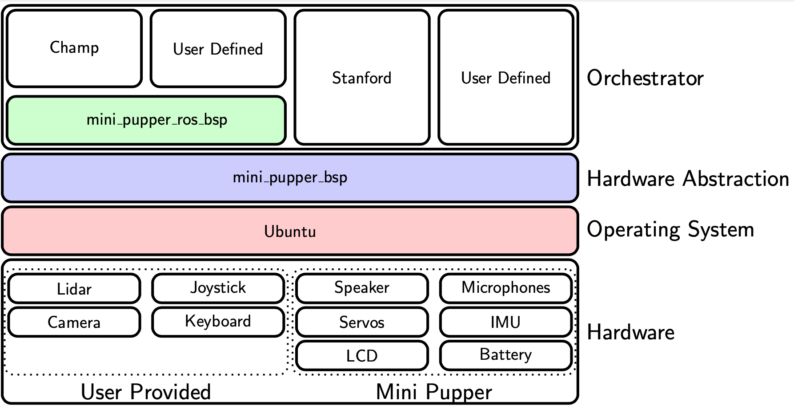

# Mini Pupper

## Software



Below is a list of repositories where you can find code for your Mini Pupper. Some of these repositories are hosted by MangDang and we make every effort to maintain these repositories. Please open issues on GitHub when you see fit and submit pull requests if you can improve the code.

We are an open community and welcome contributions. If you have written code for Mini Pupper that you want to share please submit a PR to this repo with the details.

We also provide full stacks that come with a setup script that you can run starting with an SD card with Ubuntu installed. Clone this repository, run the setup script for the stack you want to install and wait until the Raspberry Pi reboots. See below for details.

We highlight the Status of the code as follows:

- **experimental**: this is code in an early stage. Be prepared to debug and discuss if you want to get involved.
- **testing**: this code should work but expect to hit some bugs. 
- **working**: the code has been tested and supposed to work as intended. You might still find bugs, please consider raising a GitHub issue.
- **production**: this code is used by many of our users and we encourage you to raise a GitHub issue should you encounter any bug.

### Installation

#### Fully Automated Installation

Prepare an SD card with the operating system required for your stack. 

Jammy: `ubuntu-22.04.2-preinstalled-server-arm64+raspi.img.xz` is recommended.

https://cdimage.ubuntu.com/releases/22.04/release/

Clone this repository on the PC where you have created your SD card. Make sure the SD card is mounted. Run

```
prepare_sd.py
```

And answer the questions. At the end, it will show "Flashed cloud-config successfully"  
Then eject your SD card, stick it into Mini Pupper, boot Mini Pupper and wait until the IP address is shown on the LCD.  
Initial setup on Raspberry Pi takes an hour or more.

You can use `lsblk` command to check the full path to SD card on Ubuntu, similar to `/media/username/system-boot/`.

If you are using Windows, run `prepare_sd.bat` instead of `prepare_sd.py`.

#### Pre-build Images

You can flash your SD card with pre-build images. The list of available images will be pusblished here shortly

### Reconfiguration

If you need to change WiFi credential or the ubuntu user password run

```
mini_pupper_reconfigure.py
```

And answer the questions.
Then eject your SD card, stick it into Mini Pupper, boot Mini Pupper and wait until the IP address is shown on the LCD.

### Hosted by MangDang

#### Repositories

You will find these repos under https://github.com/mangdangroboticsclub

| Repository                       | Description                                                                                        | Status       |
| ---                              | ---                                                                                                | ---          |
| mini_pupper_bsp                  | BSP(board support package) for Mini Pupper.                                                        | working      |
| StanfordQuadruped -b mini_pupper | This is a fork of the StanfordQuadruped repository with modification to make it run on Mini Pupper | working      |
| mini_pupper_web_controller       | This code provides a web GUI for Mini Pupper running StanfordQuadruped                             | testing      |
| mini_pupper_ros -b ros1          | This code used Champ and ROS1 to control Mini Pupper.                                              | testing      |
| mini_pupper_ros -b ros2          | This code used Champ and ROS2 to control Mini Pupper.                                              | experimental |

#### Full Stacks

| Name     | OS    | Description                                                                                                        |
| ---      | ---   | ---                                                                                                                |
| Stanford | Jammy | Allows to control your Mini Pupper with either a supported PS4 joystick or a Web GUI using the Stanford controller |
| ROS2     | Jammy | Run ROS2 on your Mini Pupper.                                                                                      |

### Contributions

#### Repositories

| Repository                                                                               | Description                                                                                                                                                                      | Status       |
| ---                                                                                      | ---                                                                                                                                                                              | ---          |
| [minipupper_kinematics](https://github.com/hdumcke/minipupper_kinematics)                | This repositories contains Jupyter notebook that I used to gain a better understanding of the kinematics of a quadruped robot in general and MangDang Mini Pupper in particular. | experimental |
| [mini-pupper-jupyter-notebooks](https://github.com/Tiryoh/mini-pupper-jupyter-notebooks) | ROSCon2022 Jupyter Notebooks for Mini Pupper.                                                                                                                                    | experimental |
